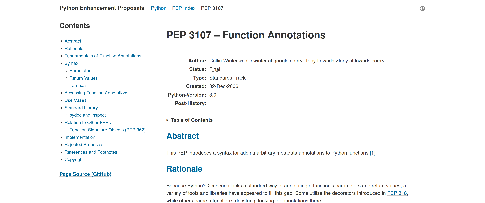
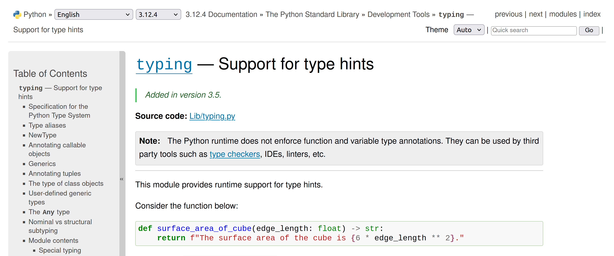

Those annotations can have things other than typing?!
=====================================================

Mattijs Ugen

---

whoami
======

- data engineer @ Netherlands Forensic Institute, The Hague
- use a lot of Python in our day-to-day
  - see [Threat to Life: Preventing Planned Murders with Python](https://www.youtube.com/watch?v=rrckKR305TU) @ EP2023

---

> Annotating functions with typing information is commonplace nowadays. 
> Annotations have become synonymous with typing information, even though they could be just about anything you’d want. 
> Are there use cases for function annotations other than typing? Is that useful? 
> 
> Should you care? 
> 
> Should you stop using typing?

---

Should you stop using typing?
=============================

no!

if you like using typing, use it!

---

So what are we talking about?
=============================

~~~
@cache
def calculate_thing(argument: bytes, n: int = 1) -> float:
  ...
~~~

So, typing, right?
==================

---

Right, so what else…
====================

~~~
def H(b):
    ...

def schnorr(M, x):
    ...
    e = H(r + M)
    s = k + e * x
    return s, e
~~~

*example only, please don't assume this is correct*

---

Translation into a different domain
===================================

**annotating the code with their symbolic counterparts**

---

Guarding against mistakes
=========================

**annotating the code with parameter guards**

---

Takeaways
=========

- annotations are just python
- any expression will do
- not all of them will make sense
- but there's more than typing
- …
- if you want there to be
